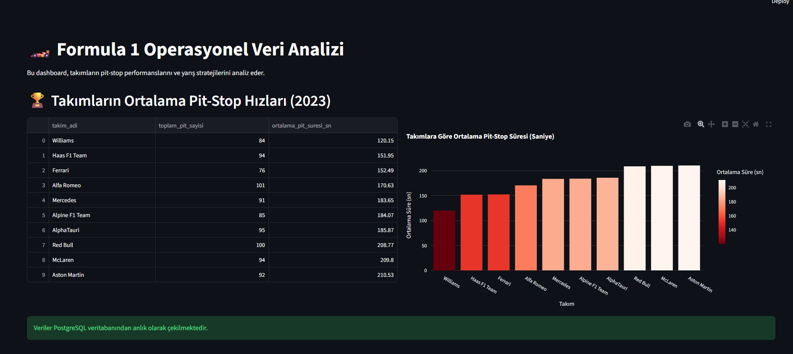

# 🏎️ Formula 1 Operasyonel Veri Analizi ve Pit-Stop Optimizasyonu

## 📌 Proje Hakkında
Bu proje, 1950-2023 yılları arasındaki Formula 1 yarış verilerini kullanarak takımların operasyonel süreçlerini (özellikle pit-stop stratejilerini) analiz eden uçtan uca (End-to-End) bir veri projesidir. 

Projenin arka planı **PostgreSQL** ile modellenmiş olup, ileri seviye SQL sorguları (CTE, Window Functions) ile veri setinden anlamlı içgörüler çıkarılmıştır. Elde edilen bu veriler **Python ve Streamlit** kullanılarak interaktif bir web paneline (Dashboard) dönüştürülmüştür.

## 📸 Dashboard Görünümü

## 🚀 Öne Çıkan Analizler ve İş Kararları (Business Insights)
* **Hız vs. İstikrar (Standart Sapma):** Sadece ortalama hıza değil, pit-stop istikrarına bakıldığında şaşırtıcı şekilde **HRT** takımının en düşük standart sapmaya (en az hata payına) sahip olduğu matematiksel olarak kanıtlanmıştır.
* **Zamanın Maliyeti (Sıra Kaybı):** Geliştirilen CTE modeli ile, yarışta yaşanan 10+ saniyelik sorunlu bir pit-stop'un (Örn: Valtteri Bottas - Alfa Romeo) pilotun yarış bitiriş pozisyonuna doğrudan eksi (-) yönlü etkisi modellenmiştir.
* **Undercut Stratejisi:** `LAG/LEAD` fonksiyonları kullanılarak pilotların pite girmeden önceki ve sonraki tur süreleri karşılaştırılmış, erken pite girmenin avantajları incelenmiştir.

## 📂 Proje Yapısı
* `/data`: Analiz için kullanılan ham CSV dosyaları.
* `/sql_scripts`: Veritabanı kurulumu ve karmaşık analitik sorgular.
* `app.py`: Streamlit interaktif web uygulaması kaynak kodu.
* `requirements.txt`: Gerekli Python kütüphaneleri.

## 🛠️ Nasıl Çalıştırılır?
Bu projeyi kendi bilgisayarınızda çalıştırmak için aşağıdaki adımları izleyin:

1. Repoyu bilgisayarınıza klonlayın:
   `git clone https://github.com/btunahansahin/F1-Optimization-Project.git`
2. Gerekli kütüphaneleri yükleyin:
   `pip install -r requirements.txt`
3. PostgreSQL veritabanınızı `sql_scripts` içindeki kodlarla ayağa kaldırın.
4. `app.py` içindeki veritabanı şifre/kullanıcı adı kısımlarını kendi yerel sunucunuza göre güncelleyin.
5. Uygulamayı başlatın:
   `streamlit run app.py`

---
*Bu proje, SQL analitik fonksiyonlarının ve Python veri görselleştirme yeteneklerinin birleştirilmesiyle oluşturulmuştur.*